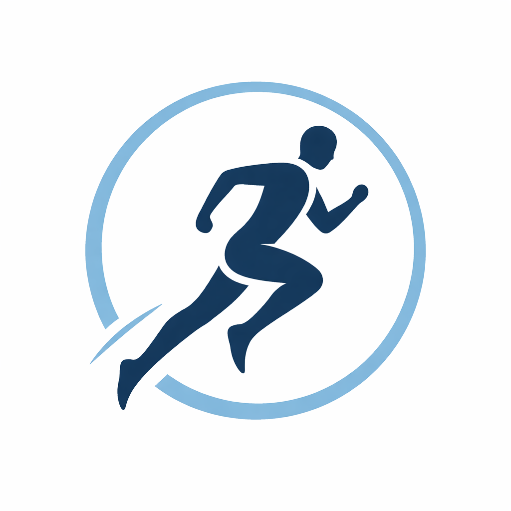

# Training OS



Training OS is a personal training tracker focused on a clear split between:

- **what happened** (sessions + notes), and
- **what was planned** (weekly plan).

It is local-first, simple to use weekly, and ready for deeper coaching features over time.

## Current scope

- Weekly calendar with sessions and day notes
- Weekly plan as a separate intent layer
- Weekly/rolling analysis views
- Data ingestion from FIT exports and Strava

## Quick start

```bash
# backend
cd backend
python3 -m venv venv
source venv/bin/activate
pip install -r requirements.txt
uvicorn app.main:app --reload

# frontend (new terminal)
cd ../frontend
python3 -m http.server 3000
```

- App: <http://localhost:3000>
- API docs: <http://localhost:8000/docs>

## Sync / import

```bash
# refresh new Strava activities
curl -X POST "http://localhost:8000/api/integrations/strava/import/refresh"

# full Strava backfill
curl -X POST "http://localhost:8000/api/integrations/strava/import/backfill?per_page=100&max_pages=40"

# FIT import
cd backend && source venv/bin/activate && python scripts/import_fit.py
```

## Direction

See [ROADMAP.md](ROADMAP.md) for upcoming product phases.
