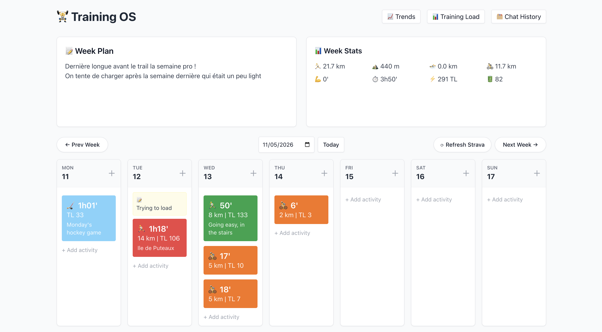
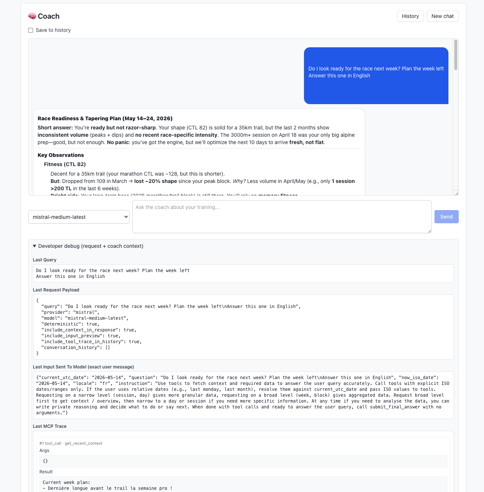
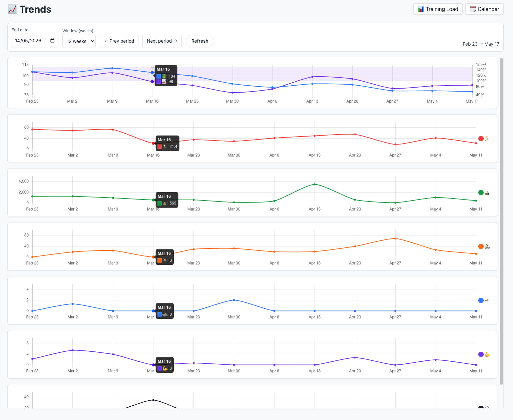
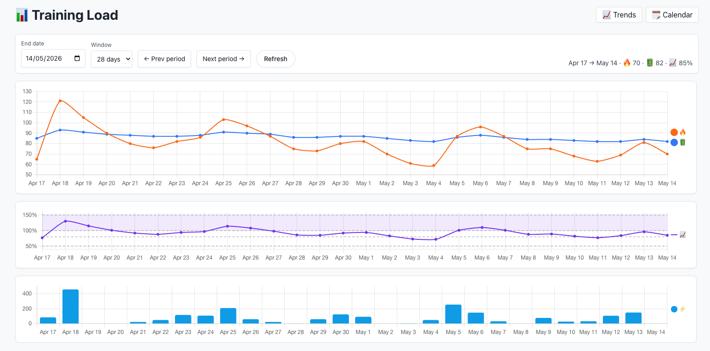

# Training OS

Training OS is a personal training coach and analytics playground — a weekly-first training calendar that combines structured sessions (FIT/Strava) with a lightweight planning layer and an LLM-powered coach interface.



## Highlights

- Week-centric UX: separate *Actuals* (sessions & notes) and *Plan* (weekly intent)
- Training Load pipeline: TL (per-hour based), ATL (7d), CTL (42d) and ACWR
- Live coaching tools: MCP-based LLM tools that can query your session history
- Polished visual reports: merged CTL+ACWR view, per-week CTL shown as-of-today

## Screenshots

- **Calendar** (weekly sessions, plan & actuals, inline edit):

  

- **Coach** (LLM-powered coaching chat):

  

- **Trends** (CTL + ACWR, period-based analytics):

  

- **Training Load** (weekly load, daily breakdown, week stats):

  

- Weekly calendar workflow for sessions and day notes
- Weekly plan as a separate intent layer
- MCP tools for agentic coaching queries
- Analysis views (`analysis.html`, `training-load.html`, `chat-history.html`)
- Strava sync + FIT import
- Training load pipeline (TL / ATL / CTL / ACWR)

## Quick start

### One command (dev)

```bash
./scripts/dev_up.sh
```

### Manual (backend + frontend)

```bash
# backend
cd backend
python3 -m venv venv
source venv/bin/activate
pip install -r requirements.txt
uvicorn app.main:app --reload

# frontend (new terminal)
cd ../frontend
python3 -m http.server 3000
```

- App: http://localhost:3000
- API docs: http://localhost:8000/docs

## MCP server (coaching tools)

The LLM service runs in MCP mode and can call tool functions over your training data before composing an answer. Key tools include `get_week_summary`, `get_day_details`, `get_session_details`, and more.

Main implementation points:

- Tool schema + executor: `backend/app/llm/mcp_tools.py`
- LLM orchestration: `backend/app/llm/service.py`
- Provider adapters: `backend/app/llm/providers.py`
- Prompt loading/compilation: `backend/app/llm/prompt_loader.py`

## Training load model (TL / ATL / CTL)

Training OS uses a moving-time based TL signal and derives:

- **ATL**: 7-day exponential response
- **CTL**: 42-day exponential response
- **ACWR**: ATL / CTL

Parameters live in `backend/app/core/training_load_defaults.py` and the propagation logic is implemented in `backend/app/training_load.py`.

## Strava sync and import

```bash
# refresh new Strava activities
curl -X POST "http://localhost:8000/api/integrations/strava/import/refresh"

# full Strava backfill
curl -X POST "http://localhost:8000/api/integrations/strava/import/backfill?per_page=100&max_pages=40"

# FIT import
cd backend && source venv/bin/activate && python scripts/import_fit.py
```

## Tech stack and libraries

Backend:

- FastAPI, Uvicorn
- SQLAlchemy (SQLite)
- Pydantic / pydantic-settings
- `fitparse` / `fitdecode` for FIT ingestion

Frontend:

- Alpine.js
- Tailwind CSS (CDN)
- Chart.js
- marked + DOMPurify for coach markdown rendering

## Project direction

Roadmap is intentionally paused for now. See [ROADMAP.md](ROADMAP.md) for the current maintenance-mode status.
